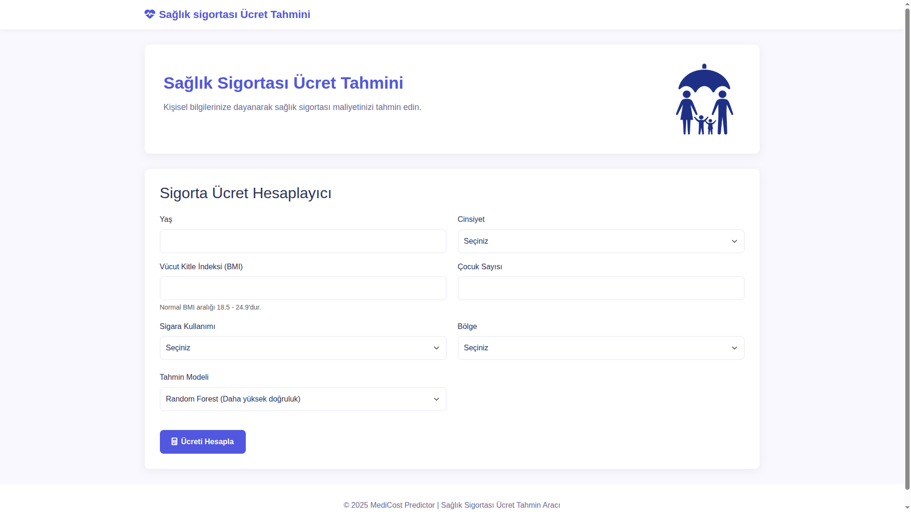
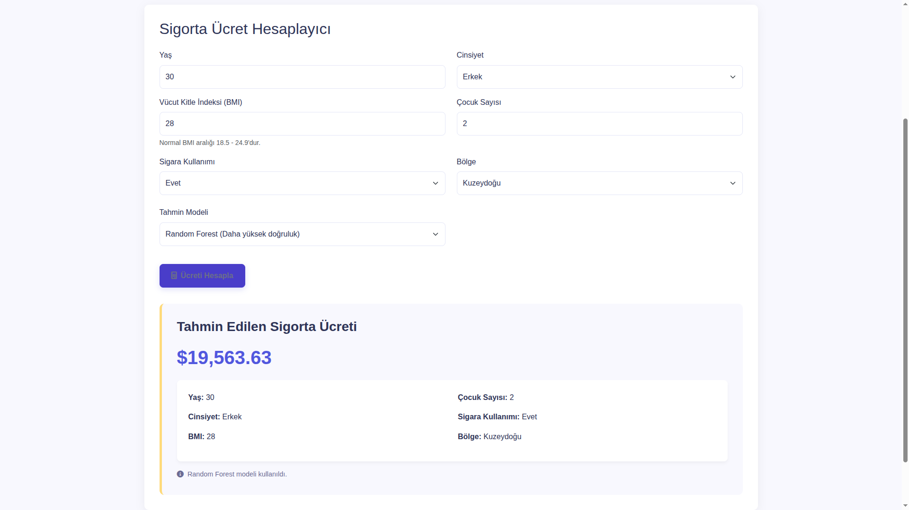

# Sağlık Sigortası Ücret Tahmin Uygulaması

Bu proje, kişilerin demografik ve sağlık durumuna göre sağlık sigortası ücretlerini makine öğrenmesi modelleri ile tahmin eden bir web uygulamasıdır. Kullanıcılar yaş, cinsiyet, vücut kitle indeksi (BMI), çocuk sayısı, sigara kullanım durumu ve yaşadıkları bölge gibi bilgileri girerek, tahmini sigorta maliyetlerini öğrenebilirler.

## Özellikler

- Sağlık sigortası ücretlerini tahmin etmek için iki farklı makine öğrenmesi modeli:
  - Linear Regression (Doğrusal Regresyon)
  - Random Forest Regressor (Rastgele Orman Regresyon)
- Kullanıcı dostu web arayüzü
- RESTful API hizmeti
- Tekil ve toplu tahmin yapabilme imkanı
- Detaylı sonuç analizi

## Web Arayüzü

Kullanıcı girişi ekranı:



Tahmin sonuçları ekranı:



## Teknolojiler

### Backend
- Python 3.9+
- Flask - Web framework
- Pandas - Veri manipülasyonu ve analizi
- Scikit-learn - Makine öğrenmesi modelleri
- NumPy - Sayısal işlemler
- Joblib - Model serileştirme

### Frontend
- HTML5
- CSS3
- JavaScript
- Bootstrap 5
- Font Awesome

## Kurulum

### Gereksinimler
Projeyi çalıştırmak için aşağıdaki gereksinimlere ihtiyaç vardır:

```bash
pip install -r requirements.txt
```

### Veri Seti
Veri setini indirmek için:

```bash
bash scripts/get-dataset.sh
```

### Model Eğitimi
Makine öğrenmesi modellerini eğitmek için Jupyter Notebook'u kullanabilirsiniz:

```bash
jupyter notebook run.ipynb
```

### Uygulamayı Çalıştırma
Web uygulamasını başlatmak için:

```bash
python service.py
```

Uygulama varsayılan olarak http://localhost:5005 adresinde çalışır.

## API Kullanımı

### Tekil Tahmin

```bash
curl -X POST -H "Content-Type: application/json" -d '{
  "age": 30, 
  "sex": "male", 
  "bmi": 25.0, 
  "children": 1, 
  "smoker": "no", 
  "region": "northeast", 
  "model": "random_forest"
}' http://localhost:5005/predict
```

### Toplu Tahmin

```bash
curl -X POST -H "Content-Type: application/json" -d '{
  "data": [
    {"age": 30, "sex": "male", "bmi": 25.0, "children": 1, "smoker": "no", "region": "northeast"},
    {"age": 45, "sex": "female", "bmi": 30.5, "children": 2, "smoker": "yes", "region": "southeast"}
  ],
  "model": "random_forest"
}' http://localhost:5005/predict_batch
```

## Dosya Yapısı

```
.
├── data/
│   └── medical-charges.csv      # Eğitim veri seti
├── models/
│   ├── linear_regression_model.pkl  # Eğitilmiş doğrusal regresyon modeli
│   └── random_forest_model.pkl      # Eğitilmiş rastgele orman modeli
├── res/
│   ├── 1.png                    # Uygulama ekran görüntüsü 1
│   └── 2.png                    # Uygulama ekran görüntüsü 2
├── scripts/
│   ├── example.sh               # API örnek kullanım betiği
│   └── get-dataset.sh           # Veri seti indirme betiği
├── static/
│   ├── index.html               # Web arayüzü
│   └── logo.png                 # Uygulama logosu
├── requirements.txt             # Bağımlılıklar
├── run.ipynb                    # Model eğitim ve analiz notebook'u
├── service.py                   # Flask web servisi
└── README.md                    # Bu dosya
```

## Modeller Hakkında

Proje iki farklı makine öğrenmesi modelini kullanmaktadır:

1. **Linear Regression (Doğrusal Regresyon)**  
   Basit ve anlaşılır bir model. Veri setindeki değişkenlerle sigorta ücretleri arasında doğrusal bir ilişki olduğunu varsayar.

2. **Random Forest (Rastgele Orman)**  
   Daha karmaşık ve genellikle daha iyi performans gösteren bir model. Birden fazla karar ağacı kullanarak tahmin yapar.

## Veri Seti

Bu projede kullanılan veri seti, ABD'de bireysel sağlık sigortası ücretlerini içermektedir. Veri şu değişkenleri içerir:

- **age**: Kişinin yaşı
- **sex**: Kişinin cinsiyeti (female, male)
- **bmi**: Vücut kitle indeksi
- **children**: Bakmakla yükümlü olduğu çocuk sayısı
- **smoker**: Sigara içme durumu (yes, no)
- **region**: ABD'deki bölge (northeast, southeast, southwest, northwest)
- **charges**: Sağlık sigortası yıllık ücretleri (tahmin edilmeye çalışılan değişken)

## Lisans

Bu proje [LICENSE](LICENSE) dosyasında belirtilen lisans altında dağıtılmaktadır.
